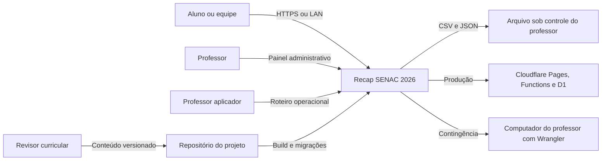
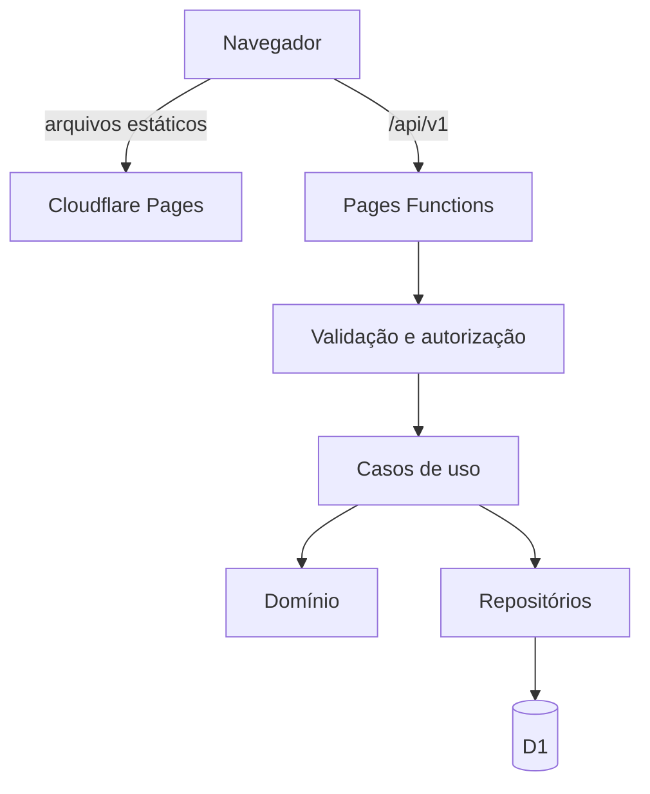

> Resumo: a solução será um monólito modular React e TypeScript, compilado pelo Vite, com Pages Functions e D1 no ambiente Cloudflare e persistência local pelo Wrangler na contingência. O desenho concentra regras no servidor, conteúdo versionado por esquema, pontuação por eventos idempotentes e seis módulos funcionais com contratos explícitos.

# Arquitetura da solução

```json
{"id":"DOC-ARQ-001","tipo":"arquitetura-solucao","versao":"1.0","estado":"ATIVO","idioma":"pt-BR","data_base":"2026-09-18","stack_verificada":{"node":"26.5.1","npm":"11.17.0","react":"19.3.0","vite":"8.3.0","typescript":"7.0.2","wrangler":"4.135.0","zod":"4.6.5","vitest":"5.0.1","playwright":"1.63.0"}}
```

Documentos relacionados: [requisitos](../00_governanca/03_requisitos.md), [decisões](../00_governanca/01_decisoes.md), [riscos](../00_governanca/02_riscos.md), [visão geral](../00_governanca/00_visao-geral.md) e [contrato do projeto](../../AGENTS.md).

## 1. Objetivos arquiteturais

A arquitetura deve viabilizar um primeiro fluxo completo do portal sem impedir o simulado posterior. Ela deve operar publicada na Internet, sobreviver a uma contingência em rede local, aceitar 18 participantes simultâneos com margem, preservar uma trilha explicável de pontuação e permitir que professores revisem conteúdo sem editar componentes. A solução não pretende ser um ambiente acadêmico institucional, uma plataforma de provas de alta segurança nem um serviço multi-escola na primeira versão.

Os atributos prioritários, em ordem de influência sobre o desenho, são integridade da pontuação, operabilidade durante a aula, clareza pedagógica, acessibilidade, privacidade, testabilidade e simplicidade de implantação. Desempenho importa para manter ritmo, mas não justifica cache que esconda inconsistência. Escalabilidade além do evento é desejável, mas não autoriza microsserviços, filas ou infraestrutura distribuída sem necessidade demonstrada.

O princípio central é uma base de código única com fronteiras internas. O navegador gerencia apresentação e estado transitório; a API valida comandos e aplica autorização; o domínio decide transições e pontuação; repositórios isolam D1; arquivos estruturados são a fonte versionada do conteúdo; exportações preservam evidência fora do provedor.

## 2. Visão de contexto



O retângulo `app` representa o mesmo produto lógico nos dois ambientes. A implantação publicada usa a borda e o banco gerenciado. A contingência usa um processo no computador do professor e banco local compatível. Arquivos exportados não são sincronização automática; são artefatos deliberados, versionados e protegidos conforme a política de dados.

Não existe integração obrigatória com identidade SENAC, e-mail, serviço de certificado ou sistema acadêmico. O aluno não precisa criar conta. O único sistema externo necessário para produção é Cloudflare; a operação local reduz essa dependência, mas ainda exige rede entre dispositivos quando houver múltiplos clientes.

## 3. Topologias de execução

### 3.1. Ambiente publicado

O Vite produz ativos estáticos servidos pelo Pages. Requisições sob `/api/*` são tratadas por Pages Functions. A Function recebe bindings tipados, valida método, origem, corpo e autorização, invoca um caso de uso e acessa D1 por repositório. Migrações SQL definem estrutura e índices. Configurações públicas entram no build apenas quando não forem segredos; segredos e identificadores do ambiente ficam em configuração do provedor.



### 3.2. Ambiente local

O launcher Windows prepara ou verifica dependências e inicia o comando suportado pelo Wrangler em endereço acessível na LAN, repassando argumentos `%*`. A mesma árvore de Functions e as mesmas migrações operam contra persistência local. O launcher não altera firewall automaticamente, não solicita elevação silenciosa e não baixa conteúdo no meio da aula. O guia orienta o professor a verificar endereço, porta e acesso por segundo dispositivo.

A interface mostra `LOCAL` ou `PUBLICADO`, versão e saúde da API no painel. Essa distinção impede que o professor suponha que sessões de um ambiente existem no outro. A primeira versão não inclui replicação bidirecional. Exportar e importar, quando a importação for implementada e validada, será ação administrativa explícita.

### 3.3. PWA

O manifesto e o service worker podem melhorar instalação e cache dos ativos, mas não substituem API, D1 ou comunicação entre dispositivos. A estratégia de cache deverá ser conservadora: ativos imutáveis podem usar cache por versão; HTML e chamadas de API devem evitar resposta obsoleta que esconda estado da sessão. Antes de ativar atualização em segundo plano, testes precisam demonstrar que uma versão nova não quebra uma sessão em andamento.

## 4. Decomposição modular

O código de aplicação será organizado por capacidade, conforme DECISAO-010:

| Módulo | Responsabilidade | Pode depender de | Não pode conter |
|---|---|---|---|
| `recap` | Sessões coletivas, equipes, rodadas, desafios, placar e reconhecimento | `content`, `reporting`, `shared` | Regras específicas de tentativa do simulado |
| `simulado` | Configuração, sorteio, tentativa, resposta, correção, explicação e reforço | `content`, `reporting`, `shared` | Regras do ranking coletivo do portal |
| `content` | Taxonomia, esquemas, catálogo, versões, importação e cobertura | `shared` | Componentes de sessão ou autenticação |
| `reporting` | Projeções, reconciliação, CSV, JSON e métricas pedagógicas | Contratos públicos de `recap`, `simulado`, `content`, `shared` | Mutação direta de pontuação |
| `administration` | Autorização docente, configuração, saúde, retenção e operações controladas | Contratos dos demais módulos | Regra de domínio duplicada |
| `shared` | Tipos fundamentais, resultado, relógio, IDs, erros e componentes realmente comuns | Nenhum módulo funcional | Regra que pertença a uma capacidade específica |

Cada módulo pode conter `domain`, `application`, `infrastructure` e `ui` quando essas camadas forem necessárias. Não serão criadas pastas vazias para simular arquitetura. Regra pura mora no domínio; orquestração e portas no nível de aplicação; D1, HTTP e armazenamento na infraestrutura; componentes e adaptadores de tela na interface. Importações cruzadas usam somente um ponto público do módulo. Um teste de arquitetura ou regra de lint deverá detectar acesso a caminho interno.

O frontend e as Functions podem compartilhar tipos estáveis, mas não confiar apenas em tipos TypeScript, que desaparecem em runtime. Zod validará fronteiras de arquivo, formulário e HTTP. Tipos serão inferidos de esquemas quando isso reduzir divergência. Entidades de domínio não dependerão de componentes React ou do objeto de requisição Cloudflare.

## 5. Organização física proposta

```text
/
|-- functions/
|   `-- api/                         # Adaptadores HTTP do Pages
|-- migrations/                      # Migrações D1 ordenadas
|-- src/
|   |-- app/                         # Composição, rotas e providers
|   |-- modules/
|   |   |-- recap/
|   |   |-- simulado/
|   |   |-- content/
|   |   |-- reporting/
|   |   |-- administration/
|   |   `-- shared/
|   |-- styles/                      # Tokens e estilos globais
|   `-- main.tsx
|-- content/
|   |-- taxonomy/
|   |-- activities/
|   `-- questions/
|-- tests/
|   |-- integration/
|   |-- e2e/
|   |-- accessibility/
|   `-- fixtures/
|-- docs/
|-- artifacts/
|-- public/
|-- package.json
|-- wrangler.jsonc
`-- iniciar.bat
```

Testes unitários permanecem próximos ao código quando protegem regra local. `tests/integration` contém cenários que cruzam API e D1; `tests/e2e` contém fluxos pelo navegador. Fixtures são fictícias, sem nomes reais. `artifacts` recebe relatórios, capturas, logs transitórios e resultados gerados; não recebe fonte que a aplicação precise para compilar.

## 6. Modelo de domínio

As entidades principais são `Session`, `Team`, `ParticipantSession`, `ActivityDefinition`, `Round`, `QuestionDefinition`, `QuizAttempt`, `QuestionPresentation`, `Answer`, `ScoreEvent`, `ContentVersion` e `ExportRecord`. Identificadores são opacos, estáveis e gerados no servidor. Horários são armazenados em UTC e convertidos apenas na apresentação. Campos de texto recebem limites definidos no esquema.

Uma sessão possui estado `DRAFT`, `LOBBY`, `ACTIVE`, `PAUSED` ou `CLOSED`. Transições inválidas retornam erro de domínio e não fazem mutação parcial. Uma equipe pertence exatamente a uma sessão. Uma rodada referencia uma versão imutável da atividade. Uma tentativa referencia as versões das questões apresentadas, inclusive a ordem das alternativas. Uma resposta preserva valor original e resultado da regra aplicada.

`ScoreEvent` é a fonte de verdade do placar. Ele contém `id`, `sessionId`, `teamId`, `roundId` quando aplicável, `idempotencyKey`, `kind`, `points`, `reason`, `actorKind`, `actorId` pseudônimo, `createdAt` e metadados permitidos. Uma restrição única combina escopo e chave idempotente. O total é uma projeção calculada por soma, podendo existir cache reconstruível para leitura. Correção usa evento compensatório; não altera silenciosamente o passado.

`QuestionDefinition` possui estado `DRAFT`, `IN_REVIEW`, `APPROVED`, `REJECTED` ou `RETIRED`. Somente `APPROVED` entra em sorteio. Alterar enunciado, resposta, explicação ou referência curricular cria nova versão. Desativar uma versão impede novas seleções sem remover tentativas históricas.

## 7. Persistência e esquema relacional

As primeiras migrações deverão criar tabelas conceitualmente equivalentes a:

- `sessions`, com código público indexado, estado, configuração, versão e datas;
- `teams`, com unicidade de nome normalizado por sessão;
- `participant_sessions`, com token derivado ou hash, equipe, identificação opcional e expiração;
- `activity_versions` e `rounds`;
- `score_events`, com unicidade da chave idempotente no escopo;
- `question_versions`, `quiz_attempts`, `question_presentations` e `answers`;
- `content_imports`, para registrar versão, hash e resultado;
- `exports`, sem armazenar desnecessariamente o arquivo completo;
- `admin_audit_events`, para ações privilegiadas.

Chaves estrangeiras e índices devem refletir consultas reais: sessão por código, equipes por sessão, eventos por sessão e equipe, rodadas ativas, tentativas por sessão e respostas por tentativa. JSON no banco será reservado a metadados de extensão validados; relações essenciais não ficarão escondidas em um blob. Migrações são somente incrementais e testadas tanto em banco vazio quanto em banco da versão anterior suportada.

O prazo de retenção ainda não foi aprovado. Portanto, o esquema deve permitir expiração e exclusão controlada, mas nenhuma rotina automática será ativada com prazo inventado. O portão de produção impedirá coleta nominal até que a política seja registrada.

## 8. Contrato HTTP

Todos os endpoints usam prefixo `/api/v1`. Respostas de sucesso têm dados tipados; erros seguem envelope com `code`, `message`, `requestId` e detalhes de campo seguros. Mensagens para o usuário são acionáveis; detalhes internos não atravessam a fronteira. Métodos que alteram estado exigem `Content-Type` adequado, validação Zod e, quando aplicável, cabeçalho `Idempotency-Key`.

Rotas iniciais previstas:

| Grupo | Operações principais | Autorização |
|---|---|---|
| `/health` | saúde, ambiente e versão sem segredo | Pública, resposta mínima |
| `/sessions` | criar, configurar, ativar, pausar e encerrar | Professor |
| `/join` | validar código e criar participação temporária | Código de sessão e limites de abuso |
| `/sessions/:id/teams` | listar visão pública ou administrar equipes | Participante para leitura limitada; professor para mutação |
| `/sessions/:id/rounds` | iniciar, responder e encerrar rodada | Conforme comando e estado |
| `/sessions/:id/score-events` | registrar comando e ler projeção | Professor ou regra automática autorizada |
| `/content` | listar catálogo aprovado e cobertura | Leitura limitada; importação por professor |
| `/attempts` | criar tentativa, responder, concluir e reforçar | Participante temporário |
| `/reports` | resumo, CSV e JSON | Professor; aluno recebe apenas sua visão permitida |

A API não aceitará `points`, `isCorrect`, `teamTotal` ou papel administrativo como afirmações confiáveis do cliente. Ela recebe intenção e dados de resposta, consulta definição autorizada e calcula efeito. Controle de concorrência usa transação e restrições do banco. O tratamento de erro idempotente retorna o resultado original quando a chave representa o mesmo comando; reutilização com payload diferente retorna conflito.

## 9. Aleatoriedade e correção

Sorteio usa gerador com semente armazenada ou identificador derivável por tentativa, para que a apresentação possa ser auditada. A seleção primeiro determina conjunto elegível por estado, eixo, UC, dificuldade e tipo; depois amostra sem reposição. Se o conjunto for insuficiente, a criação falha com diagnóstico, em vez de relaxar filtros silenciosamente.

Na múltipla escolha, alternativas recebem IDs independentes da posição. A permutação altera somente ordem. Verdadeiro ou falso usa valor booleano e explicação obrigatória. Resposta curta aplica uma sequência declarada de normalizações seguras, como aparar espaços, comparar sem distinção de maiúsculas quando configurado e aceitar variantes exatas. Remover acentos, pontuação ou palavras só ocorre quando a regra do item autorizar. Não haverá avaliação por modelo externo na primeira versão.

O feedback completo aparece depois do envio ou encerramento conforme configuração, mas nunca revela questão ainda elegível para resposta ativa. O reforço constrói conjunto a partir de respostas incorretas da tentativa anterior, excluindo itens retirados ou pendentes de revisão.

## 10. Segurança e privacidade

O modelo de ameaças prioriza acesso administrativo por aluno, manipulação de pontuação, enumeração de código, injeção, exposição em exportação e vazamento de segredo. A autorização deve existir no servidor em cada caso de uso, não somente na rota ou interface. Códigos públicos possuem expiração e limitação de tentativas. Tokens de participação são armazenados de modo que seu valor bruto não precise aparecer em logs.

Headers de segurança, política de conteúdo e origem serão definidos de acordo com o ambiente. SQL usa statements parametrizados. Texto de usuário é apresentado como texto, não HTML arbitrário. Downloads usam nome seguro, tipo correto e `Content-Disposition`. Logs incluem `requestId`, tipo de ação e identificadores técnicos, sem resposta aberta, nome ou segredo por padrão.

O mecanismo final de autenticação docente ainda é portão arquitetural. A implementação deve isolar uma interface `AdminAuthorizer` para permitir segredo forte de evento no MVP local e mecanismo gerenciado ou institucional depois, sem espalhar comparação de senha. Não será publicada uma credencial fixa embutida no frontend.

## 11. Frontend e acessibilidade

React será usado para rotas e componentes interativos; estado remoto terá uma camada de cliente explícita e estado de formulário permanecerá local quando possível. Não haverá store global para todo dado. O roteamento separa entrada, experiência da equipe, tela pública e administração. Cada tela deve lidar com carregamento, vazio, erro recuperável, acesso negado e versão incompatível.

O sistema visual usa tokens CSS para cor, espaçamento, tipografia, foco e movimento. Semântica HTML nativa antecede componentes customizados. Modais mantêm foco e permitem fechar por teclado quando seguro. Atualizações do placar usam região viva moderada apenas quando não causarem interrupção excessiva. Preferência por movimento reduzido desativa animações não essenciais. Arrastar e soltar, se usado na montagem de hardware, terá operação equivalente por seleção e botões.

A interface será responsiva, mas o alvo primário é navegador de computador em sala. Telas pequenas ainda devem preservar fluxos essenciais. Mensagens evitam jargão técnico e não expõem stack trace. O projeto usará português do Brasil na interface, com chaves centralizadas para permitir revisão de texto.

## 12. Conteúdo como dados

Taxonomia e itens ficam sob `content/` em JSON ou TypeScript declarativo sem efeito colateral, escolhendo-se um formato único após protótipo do esquema. Zod valida IDs, enums, referências, comprimentos, alternativas, correção e feedback. Um comando de validação produz diagnóstico com arquivo, item e campo. Um comando de cobertura conta somente itens aprovados e versões ativas.

O pipeline lógico é `rascunho -> validação estrutural -> verificação de similaridade -> revisão curricular -> aprovação -> importação`. Automação pode sugerir itens, mas não avançar para aprovado. A licença e fonte são obrigatórias quando houver material externo. Fonte curricular interna aponta para UC e referência do plano, não precisa reproduzir texto protegido.

## 13. Qualidade e observabilidade

Vitest cobre domínio, esquemas e aplicação. React Testing Library cobre interação e acessibilidade de componentes. Testes de integração executam Functions contra banco local migrado. Playwright cobre CA-001, CA-003, CA-004, CA-005 e CA-007. Verificação de acessibilidade combina analisador automático e roteiro manual. Testes de carga simulam pelo menos 18 participantes e repetição acima desse valor.

O pipeline mínimo executa formatação ou lint, tipos, conteúdo, unidade, integração, build e ponta a ponta selecionado. Uma falha retorna código diferente de zero e mantém relatório em `artifacts`. Cobertura percentual será informativa até existir limiar justificado; a matriz requisito-teste é a prova principal de que fluxos críticos não foram omitidos.

Observabilidade local e publicada usa IDs de requisição, erros estruturados e métricas simples: latência, taxa de erro, comandos idempotentes repetidos, sessões ativas e falhas de conteúdo. O painel de saúde não expõe banco, segredo ou configuração sensível. Alertas externos não fazem parte do primeiro marco, mas o guia ensina a reconhecer sinais e mudar para contingência.

## 14. Estratégia de entrega

O primeiro incremento de código estabelece toolchain, shell da interface, contratos, migração inicial e teste de saúde. O segundo fecha CA-001 com duas equipes e um quiz mínimo. O terceiro fecha idempotência, ranking e exportação. O quarto fortalece LAN, acessibilidade e documentação. Somente depois o motor do simulado e o banco de 300 questões avançam sobre contratos já comprovados.

Cada incremento termina com build e testes aplicáveis. Recursos incompletos ficam atrás de rota não exposta ou configuração explícita, nunca simulados como prontos. Publicação externa depende de credencial e autorização; sem elas, a prova termina em build e execução local, com estado `[PENDING]` para produção.

## 15. Decisões adiadas e condições de mudança

Permanecem adiados: autenticação docente definitiva, retenção, importação de exportação, regra de desempate, bônus temporal, integração institucional e sincronização entre local e produção. Cada ponto tem interface ou limite que reduz custo de mudança sem fingir decisão.

O monólito modular será revisto se houver equipes independentes, necessidade de implantação separada ou carga incompatível. D1 será revisto diante de política institucional ou teste de concorrência negativo. React e Vite serão revistos somente se alternativa reduzir custo mantendo tipagem, acessibilidade e testes. Dependências serão fixadas no lockfile; as versões verificadas nos metadados são referência de pesquisa, não autorização automática para aceitar qualquer atualização futura.

## 16. Provas de integridade da arquitetura

| ID | Estado | Afirmação | Evidência esperada |
|---|---|---|---|
| PROVA-ARQ-001 | [OK] | O documento começa com resumo, possui JSON válido e cinco links resolvidos. | Validação estrutural e de caminhos executada em 2026-09-18. |
| PROVA-ARQ-002 | [OK] | As nove versões declaradas correspondem às consultas executadas em 2026-09-18. | Comandos `node --version`, `npm --version` e `npm view` concluídos com código 0. |
| PROVA-ARQ-003 | [OK] | Os seis módulos da DECISAO-010 estão presentes e possuem limites. | Extração encontrou `recap`, `simulado`, `content`, `reporting`, `administration` e `shared`. |
| PROVA-ARQ-004 | [OK] | O arquivo usa UTF-8 sem BOM, LF, não contém pictogramas e supera 1.500 palavras. | Inspeção encontrou 2.931 palavras antes do registro final das provas. |
| PROVA-ARQ-005 | [OK] | O diff não contém erro de espaço em branco. | `git diff --check` concluído com código 0 em 2026-09-18. |
